# Citizen

[](https://golang.org/)
[](https://preactjs.com/)
[](https://www.typescriptlang.org/)
[](https://www.docker.com/)
[](https://www.postgresql.org/)
[](https://redis.io/)
[](https://traefik.io/)
[](LICENSE)

Citizen is a comprehensive, web-based management platform for modern application infrastructure. It provides an intuitive user interface to streamline application deployment, management, and monitoring, transforming command-line-driven workflows into a seamless graphical experience.

With robust features such as automated SSL, GitHub and Docker Hub integration, and enterprise-grade security, Citizen empowers developers and teams to manage their infrastructure with greater efficiency and control. It is architected as a complete dashboard for the modern application lifecycle.

---

## Quick Start

To get started with Citizen, run the following command in your terminal. This will download and start the interactive setup process.

```bash
curl -sSL https://raw.githubusercontent.com/citizenteam/citizen/main/install.sh | bash
```

---

## Overview

Citizen offers a feature-rich, web-based interface that replaces complex command-line operations with a powerful and intuitive web application. It delivers a comprehensive dashboard for overseeing your applications, complete with advanced functionalities like GitHub integration for automated deployments and extensive real-time monitoring.

### Core Features

- **Modern Web Interface**: A clean, responsive user interface that simplifies complex workflows.
- **Enterprise Authentication**: JWT-based SSO with secure session management
- **GitHub Integration**: OAuth-based repository connections with automated deployments
- **Docker Hub Support**: Private registry authentication and management
- **Automated SSL Management**: Let's Encrypt integration with Traefik reverse proxy
- **Real-time Monitoring**: Live logs, health checks, and system metrics
- **Security-First Design**: CSRF protection, security headers, and hardened containers

## 🏗️ **System Architecture**

```mermaid
graph TB
    U[👥 Users] --> T[🔀 Traefik Proxy]
    T --> F[🎨 Preact Frontend]
    T --> A[⚙️ Go API Backend]
    
    A --> DB[(🗄️ PostgreSQL)]
    A --> R[(⚡ Redis Cache)]
    A --> SSH[🔑 SSH Connection]
    SSH --> D[📦 Dokku PaaS]
    D --> AC[🚀 App Containers]
    
    A --> GH[🐙 GitHub API]
    A --> DH[🐳 Docker Hub API]
    
    T --> SSL[🔒 Let's Encrypt]
    
    subgraph "🏠 Citizen Management Layer"
        F
        A
        DB
        R
    end
    
    subgraph "🚀 Dokku Infrastructure"
        D
        AC
    end
```



### 🔄 **Data Flow**

1. **User Authentication** → JWT-based SSO with secure sessions
2. **Application Management** → Web UI → API → SSH → Dokku Commands
3. **GitHub Integration** → OAuth → Repository Connection → Automated Deployments
4. **SSL Management** → Traefik → Let's Encrypt → Automatic Certificate Generation
5. **Monitoring** → Real-time Health Checks → Live Log Streaming → System Metrics

## 📁 **Project Structure**

```
citizen/
├── 🎨 frontend/                    # Preact + TypeScript Web Interface
│   ├── src/
│   │   ├── components/            # Reusable UI components
│   │   ├── pages/                 # Application pages (Home, AppDetails, etc.)
│   │   ├── hooks/                 # Custom React hooks (useApi, etc.)
│   │   ├── context/               # Authentication context
│   │   └── types/                 # TypeScript type definitions
│   ├── Dockerfile                 # Multi-stage production build
│   └── vite.config.ts            # Vite build configuration
│
├── ⚙️ backend/                     # Go-Fiber API Server
│   ├── handlers/                  # HTTP request handlers
│   │   ├── auth.go               # Authentication & SSO
│   │   ├── dokku.go              # Dokku app management
│   │   ├── github.go             # GitHub OAuth & integration
│   │   ├── docker.go             # Docker Hub integration
│   │   └── health.go             # Health checks & monitoring
│   ├── database/                 # Database layer & models
│   │   ├── api/                  # Database API abstractions
│   │   └── migrations/           # Database schema migrations
│   ├── middleware/               # Authentication & security middleware
│   ├── models/                   # Data models & structs
│   ├── utils/                    # Utility functions & Dokku commands
│   └── routes/                   # API route definitions
│
├── 🐳 docker/                      # Container Orchestration
│   ├── config/                   # Traefik configurations
│   │   ├── traefik.yml          # Main Traefik config
│   │   ├── traefik-dev.yml      # Development config
│   │   └── dynamic_conf.yml     # Dynamic routing (auto-generated)
│   ├── scripts/                  # Automation scripts
│   │   ├── traefik/             # Traefik route generation
│   │   └── dokku/               # Dokku monitoring & integration
│   ├── dockerfiles/             # Custom Dockerfiles
│   ├── docker-compose.dev.yml   # Development environment
│   ├── docker-compose.prod.yml  # Production environment
│   └── setup.sh                 # One-command deployment script
│
└── 📋 docs/                       # Documentation
```

## **Quick Start**

### **Prerequisites**

- **Docker** 20.10+ & **Docker Compose** v2.0+
- **4GB RAM** minimum (8GB recommended for production)
- **20GB disk space** (SSD recommended)
- **Domain name** (for production SSL)
- **A Dokku-based server** with SSH access configured

### **One-Command Deployment**

For manual installation, clone the repository and execute the setup script. This will guide you through an intelligent configuration process for either development or production environments.

```bash
git clone https://github.com/citizenteam/citizen.git
cd citizen

# Run the intelligent setup script
cd docker && chmod +x setup.sh && ./setup.sh
```

### **DNS Configuration Requirements**

After successful deployment, you **MUST** configure DNS records to make your domain work properly:

#### **Required DNS Records**

```bash
# 1. Main Domain (A Record)
yourdomain.com      A     YOUR_SERVER_IP

# 2. Wildcard Subdomain (A Record)
*.yourdomain.com    A     YOUR_SERVER_IP
```

#### **DNS Setup Examples**

**For Cloudflare:**
```
Type: A     Name: @              Content: YOUR_SERVER_IP
Type: A     Name: *              Content: YOUR_SERVER_IP
```

**For Namecheap:**
```
Type: A     Host: @              Value: YOUR_SERVER_IP
Type: A     Host: *              Value: YOUR_SERVER_IP
```

**For Route53 (AWS):**
```
Type: A     Name: yourdomain.com         Value: YOUR_SERVER_IP
Type: A     Name: *.yourdomain.com       Value: YOUR_SERVER_IP
```

#### **Custom Domain Configuration**

For apps with custom domains, you have two options:

**Option 1: CNAME to subdomain (Recommended)**
```bash
# If your app is "myapp" and domain is "yourdomain.com"
customdomain.com    CNAME    myapp.yourdomain.com
```

**Option 2: Direct A record**
```bash
# Point directly to server IP
customdomain.com    A        YOUR_SERVER_IP
```

> **Important Notes:**
> - DNS changes can take up to 48 hours to propagate globally
> - SSL certificates are automatically generated after DNS is properly configured
> - Make sure to test DNS propagation with `nslookup yourdomain.com`

### **Environment Selection**

The setup script provides two optimized configurations:

#### **Development Mode**
```bash
# Perfect for local development and testing
Domain: localhost
Features: 
  - Hot reload (Air + Vite HMR)
  - Debug tools (pgAdmin, Redis Commander)
  - Verbose logging
  - Direct port access
  - Source code mounting
Security: Permissive CORS, debug endpoints enabled
SSH Keys: ~/.ssh/id_rsa (developer user)
```

#### **Production Mode**
```bash
# Enterprise-ready deployment
Domain: yourdomain.com
Features:
  - Automatic SSL certificates (Let's Encrypt)
  - Security headers (HSTS, CSP, XSS protection)
  - Read-only containers
  - Resource limits & health checks
  - Structured JSON logging
Security: Hardened containers, capability dropping, non-root users
SSH Keys: /ssh_keys/id_rsa (appuser)
Admin User: Interactive setup during installation
```

## **Access Your Platform**

After deployment, access your services:

| Service | Development | Production |
|---------|-------------|------------|
| 🎨 **Main Dashboard** | http://localhost | https://yourdomain.com |
| ⚙️ **API Endpoints** | http://localhost/api | https://yourdomain.com/api |
| 📊 **Health Monitoring** | http://localhost:3000/health | https://yourdomain.com/api/health |
| 🔧 **Traefik Dashboard** | http://localhost:8080 | https://yourdomain.com:8080 |
| 💾 **Database Admin** | http://localhost:5050 | Internal only |
| ⚡ **Redis Admin** | http://localhost:8081 | Internal only |

## **Key Functionality**

### **Application Lifecycle Management**

- **App Creation & Deletion**: Manage your applications directly through the web interface.
- **Manual & Automated Deployments**: Deploy from Git repositories with real-time log streaming or set up automated deployments via GitHub webhooks.
- **Environment Configuration**: Securely manage environment variables with automatic PORT detection.
- **Domain Management**: Add and remove custom domains with automated SSL certificate generation.
- **Buildpack Support**: Compatible with Cloud Native Buildpacks and Dockerfile-based deployments.
- **Application Control**: Start, stop, and restart applications with a single click.

### **Integrations**

#### **GitHub Integration**
- **OAuth Authentication**: Secure GitHub App integration
- **Repository Connection**: Connect GitHub repos to Dokku apps
- **Private Repository Support**: Access private repositories with user tokens
- **Branch Selection**: Deploy from specific branches
- **Webhook Management**: Automated deployment triggers (in development)

#### **Docker Hub Integration**
- **Registry Authentication**: Secure Docker Hub login management
- **Private Registry Support**: Access private Docker images
- **Connection Testing**: Verify Docker Hub connectivity
- **Credential Management**: Secure token storage and management

### **Security & Authentication**

- **JWT-based Authentication**: Secure token-based user authentication
- **SSO Session Management**: Cross-domain single sign-on support
- **CSRF Protection**: State parameter validation with crypto-secure random generation
- **Security Headers**: HSTS, CSP, X-Frame-Options, XSS protection
- **Container Security**: Distroless images, capability dropping, read-only filesystems
- **SSH Key Management**: Environment-specific SSH key configuration
- **Audit Logging**: Complete activity tracking and audit trails

### **Monitoring & Observability**

#### **Health Endpoints**
- **`/health`**: Overall system health status
- **`/health/detailed`**: Comprehensive system information
- **`/health/ready`**: Kubernetes-style readiness probe
- **`/health/live`**: Kubernetes-style liveness probe

#### **System Metrics**
- **Memory Usage**: Heap allocation, system memory, GC statistics
- **Runtime Metrics**: Goroutine count, GC runs, uptime tracking
- **Database Monitoring**: Connection pooling stats, query performance
- **Redis Monitoring**: Cache hit rates, connection status
- **Component Health**: Database, Redis, SSH connectivity status

#### **Live Monitoring**
- **Real-time Log Streaming**: Live application logs with filtering
- **Deployment Tracking**: Real-time deployment progress and logs
- **Activity Timeline**: User actions, deployments, and system events
- **Build Log Access**: Detailed build process logs and error tracking

### **User Interface Features**

- **Responsive Design**: Mobile-friendly interface with Tailwind CSS
- **Dark/Light Mode**: Adaptive theme support
- **Real-time Updates**: Live data refresh without page reloads
- **Interactive Dashboards**: App status, deployment history, metrics
- **Form Validation**: Client-side and server-side input validation
- **Error Handling**: User-friendly error messages and recovery suggestions

## **Setup Requirements**

### **Required Configurations**

1. **GitHub Integration** (For Git-based deployments):
   ```bash
   # Create GitHub OAuth App at https://github.com/settings/developers
   # Configure in Citizen UI:
   - Client ID
   - Client Secret  
   - Redirect URI: https://yourdomain.com/api/v1/github/auth/callback
   ```

2. **Docker Hub Integration** (For private registries):
   ```bash
   # Configure in Citizen UI:
   - Docker Hub Username
   - Docker Hub Access Token (not password!)
   ```

3. **Custom Domains** (Optional):
   ```bash
   # Requirements:
   - App must be marked as "public" in settings
   - DNS A record pointing to your server
   - Automatic SSL certificate generation via Let's Encrypt
   ```

4. **SSH Access** (Required):
   ```bash
   # Dokku server SSH access
   - SSH keys configured during setup
   - Dokku user permissions
   - Network connectivity to Dokku server
   ```

## **Development**

### **Local Development Setup**

```bash
# Start development environment
cd docker && ./setup.sh
# Select "Development" mode

# Access development tools
open http://localhost:5050    # pgAdmin (admin@citizen.dev / admin123)
open http://localhost:8081    # Redis Commander
open http://localhost:8080    # Traefik Dashboard
```

### **API Testing**

```bash
# Health check endpoints
curl http://localhost:3000/health
curl http://localhost:3000/health/detailed
curl http://localhost:3000/health/ready
curl http://localhost:3000/health/live

# Authentication test
curl -X POST http://localhost:3000/api/v1/auth/login \
  -H "Content-Type: application/json" \
  -d '{"username":"admin","password":"your_password"}'
```

### **Technology Stack**

**Backend Stack:**
- **[Go 1.23+](https://golang.org/)** - High-performance API server
- **[Fiber v2](https://gofiber.io/)** - Express-inspired web framework  
- **[PostgreSQL 16](https://www.postgresql.org/)** - Primary database with JSONB support
- **[Redis 7](https://redis.io/)** - Session storage & caching layer
- **[GORM](https://gorm.io/)** - ORM with auto-migrations
- **[Dokku](https://dokku.com/)** - Underlying PaaS platform

**Frontend Stack:**
- **[Preact 10](https://preactjs.com/)** - Lightweight React alternative (3KB)
- **[TypeScript 5](https://www.typescriptlang.org/)** - Type-safe JavaScript
- **[Vite](https://vitejs.dev/)** - Lightning-fast build tool with HMR
- **[Tailwind CSS](https://tailwindcss.com/)** - Utility-first CSS framework
- **[Wouter](https://github.com/molefrog/wouter)** - Minimalist routing (1.3KB)

**Infrastructure:**
- **[Docker](https://www.docker.com/)** - Containerization platform
- **[Traefik v3.4](https://traefik.io/)** - Modern reverse proxy with automatic HTTPS
- **[Let's Encrypt](https://letsencrypt.org/)** - Free SSL certificate authority

## **Production Deployment**

### ☁️ **Cloud Providers**

| Provider | Tested | Status | Guide |
|----------|--------|--------|-------|
| 🟢 **DigitalOcean** | ✅ | Production Ready | [Deploy Guide](docs/deploy-digitalocean.md) |
| 🟠 **AWS EC2** | 🧪 | Beta Testing | [Deploy Guide](docs/deploy-aws.md) |
| 🟡 **Hetzner Cloud** | 📋 | Planned | Coming Soon |
| 🔵 **Linode** | 📋 | Planned | Coming Soon |

### **System Requirements**

| Environment | CPU | RAM | Storage | Network |
|-------------|-----|-----|---------|---------|
| **Development** | 2 cores | 4GB | 20GB | 1Gbps |
| **Small Production** | 2 cores | 8GB | 50GB SSD | 1Gbps |
| **Medium Production** | 4 cores | 16GB | 100GB SSD | 1Gbps |
| **Large Production** | 8+ cores | 32GB+ | 200GB+ SSD | 10Gbps |

## **Performance & Monitoring**

### **Health Monitoring**

Built-in comprehensive health monitoring:

```bash
# System health overview
GET /health
{
  "status": "healthy",
  "timestamp": "2024-01-15T10:30:00Z",
  "environment": "production",
  "components": {
    "database": {"status": "healthy", "response_time": "2ms"},
    "redis": {"status": "healthy", "memory_usage": "45MB"},
    "ssh": {"status": "configured", "host": "dokku.example.com"}
  },
  "metrics": {
    "memory": {"alloc": 15, "sys": 25, "heap_alloc": 12},
    "goroutines": 45,
    "gc_runs": 123
  }
}
```

### **Key Performance Indicators**

- **🚀 API Response Time**: < 50ms average for health endpoints
- **💾 Memory Usage**: < 100MB per service container
- **🔄 Database Connections**: Connection pooling with max 25 connections
- **⚡ Redis Performance**: < 1ms cache response time
- **🛡️ SSL Rating**: A+ security rating with modern TLS

## **Contributing**

We welcome contributions! Please see our:

- 📋 [**Contributing Guide**](CONTRIBUTING.md)
- 🐛 [**Issue Templates**](.github/ISSUE_TEMPLATE/)
- 🔄 [**Pull Request Guidelines**](.github/PULL_REQUEST_TEMPLATE.md)
- 📝 [**Code of Conduct**](CODE_OF_CONDUCT.md)

### **Development Workflow**

1. 🍴 Fork the repository
2. 🌿 Create a feature branch (`git checkout -b feature/amazing-feature`)
3. 💫 Make your changes with tests
4. 📤 Push to the branch (`git push origin feature/amazing-feature`)
5. 🔄 Open a Pull Request with detailed description

## License

This project is licensed under the **Business Source License 1.1**.

The source code will become available under **Apache License, Version 2.0** on **2029-05-21**.

See the [LICENSE](LICENSE) file for details.

## **Acknowledgments**

- 🔥 **[Dokku](https://dokku.com/)** - The foundation PaaS platform that makes this possible
- 🚀 **[Heroku](https://heroku.com/)** - Inspiration for PaaS design patterns
- 🛠️ **Go Community** - Amazing ecosystem and development tools
- 🎨 **Preact Team** - Lightweight and efficient React alternative
- 🔀 **Traefik Team** - Modern reverse proxy with excellent Docker integration

## 📚 **Documentation**

- 📖 **[Citizen Deployment Guide](./CITIZEN_DEPLOYMENT_GUIDE.md)** - Comprehensive guide for deploying applications via Citizen
- 🚀 **[Quick Start Guide](./docker/README.md)** - Get started with Citizen installation
- 🔧 **[API Documentation](./backend/README.md)** - Backend API reference
- 🎨 **[Frontend Documentation](./frontend/README.md)** - Frontend architecture and development

## 📞 **Support & Contact**

- 📧 **Email**: selmangunes@citizen.team

---

<div align="center">

**⭐ Star this repository if it helped you! ⭐**

**Made with ❤️ by the Citizen Team**

[⬆ Back to Top](#citizen)

</div> 
