# Authentication System Overview

## System Architecture

```mermaid
graph TB
    subgraph "🌐 Client Browser"
        FE[Frontend App]
        Cookie[SSO Session Cookie<br/>• HttpOnly Secure Only<br/>• No localStorage fallback<br/>• No JWT tokens used]
    end

    subgraph "🔄 Traefik Reverse Proxy"
        TraefikEntry[Traefik Entry Point]
        ForwardAuth[ForwardAuth Middleware]
        DynamicConfig[Dynamic Configuration<br/>• Auto-generated routes<br/>• Public/Private app handling]
        Routes[Route Rules & Priorities]
    end

    subgraph "🖥️ Backend Services"
        subgraph "🔐 Authentication Layer"
            AuthRoutes[Auth Routes<br/>/api/v1/auth/*]
            SSORoutes[SSO Routes<br/>/sso/*]
            AuthHandler[Authentication Handler<br/>• Pure SSO Session based<br/>• No JWT validation]
            SSOSession[SSO Session Manager<br/>• Memory + Redis storage<br/>• Session-only auth]
        end
        
        subgraph "🛡️ Authorization Layer" 
            ProtectedMiddleware[Protected Middleware]
            ValidateEndpoint[SSO Session Validate]
            PublicAppCheck[Public App Checker<br/>• Bypasses auth for public apps]
        end
        
        subgraph "⚙️ App Configuration"
            AppSettings[App Settings Handler<br/>• Public/Private status<br/>• Custom domains]
            PublicSettings[Public App Settings<br/>• Database stored<br/>• Real-time updates]
        end
        
        subgraph "💾 Data Storage"
            PostgreSQL[(PostgreSQL<br/>• User data<br/>• App deployments<br/>• Public settings<br/>• Custom domains)]
            Redis[(Redis<br/>• SSO sessions only<br/>• No JWT tokens)]
        end
        
        subgraph "🔗 External Services"
            GitHubOAuth[GitHub OAuth]
        end
    end
    
    subgraph "🔧 Infrastructure"
        Watcher[Dokku Traefik Watcher<br/>• Monitors app changes<br/>• Detects public status<br/>• Regenerates config]
        ConfigGen[Config Generator<br/>• Dynamic route creation<br/>• Public app routing<br/>• Custom domain handling]
    end

    %% User Authentication Flow (SSO Only)
    FE -->|1. Login Request| AuthRoutes
    AuthRoutes -->|2. Validate Credentials| PostgreSQL
    AuthRoutes -->|3. Create SSO Session| SSOSession
    SSOSession -->|4. Store Session| Redis
    SSOSession -->|5. Return Session ID| AuthRoutes
    AuthRoutes -->|6. Set HttpOnly Cookie| FE
    FE -->|7. Store in Cookie Only| Cookie

    %% Request Authorization Flow
    FE -->|Protected Request| TraefikEntry
    TraefikEntry -->|Check Route| DynamicConfig
    DynamicConfig -->|Route Decision| Routes
    Routes -->|Forward to Auth| ForwardAuth
    ForwardAuth -->|Check Public App| PublicAppCheck
    PublicAppCheck -->|If Private App| ValidateEndpoint
    ValidateEndpoint -->|Check SSO Session| SSOSession
    SSOSession -->|Lookup Session| Redis
    Redis -->|Session Data| SSOSession
    SSOSession -->|Validation Result| ValidateEndpoint
    ValidateEndpoint -->|Auth Response| ForwardAuth
    PublicAppCheck -->|If Public App| ForwardAuth
    ForwardAuth -->|Allow/Deny| TraefikEntry
    TraefikEntry -->|Route to Service| AuthRoutes

    %% App Configuration Flow
    FE -->|Update Public Status| AppSettings
    AppSettings -->|Save Setting| PublicSettings
    PublicSettings -->|Store in DB| PostgreSQL
    Watcher -->|Monitor Changes| PostgreSQL
    Watcher -->|Trigger Regeneration| ConfigGen
    ConfigGen -->|Update Routes| DynamicConfig
    DynamicConfig -->|Reload Config| TraefikEntry

    %% GitHub OAuth Flow
    FE -->|OAuth Init| GitHubOAuth
    GitHubOAuth -->|Callback| AuthHandler
    AuthHandler -->|Update User Data| PostgreSQL

    %% Session Management (No JWT)
    SSOSession -->|Cleanup Expired| Redis
    
    classDef frontend fill:#e1f5fe
    classDef backend fill:#f3e5f5
    classDef storage fill:#e8f5e8
    classDef external fill:#fff3e0
    classDef proxy fill:#fce4ec
    classDef infrastructure fill:#f1f8e9
    classDef config fill:#fff8e1

    class FE,Cookie frontend
    class AuthRoutes,SSORoutes,AuthHandler,SSOSession,ProtectedMiddleware,ValidateEndpoint,PublicAppCheck,AppSettings backend
    class PublicSettings config
    class PostgreSQL,Redis storage
    class GitHubOAuth external
    class TraefikEntry,ForwardAuth,Routes,DynamicConfig proxy
    class Watcher,ConfigGen infrastructure
```

## Key Changes & Features

### 🚫 JWT Token Removal
- **Complete JWT elimination**: System now uses **SSO session cookies only**
- **No token validation**: All authentication based on secure session lookup
- **Cookie-only storage**: No localStorage fallback for enhanced security
- **Session-based auth**: Memory + Redis for session persistence

### 🔓 Public App System
- **Public/Private toggle**: Apps can be marked as public to bypass authentication
- **Database-driven config**: Public status stored in `app_public_settings` table
- **Real-time updates**: Changes detected automatically by watcher system
- **Granular control**: Per-app authentication requirements

### ⚡ Dynamic Configuration
- **Auto-generated routes**: Traefik config created from database state
- **Public app routing**: Different handling for public vs private apps
- **Custom domain support**: Redirect-based approach for non-public custom domains
- **Hot reloading**: Configuration updates without service restart

### 🔍 Monitoring & Automation
- **Watcher container**: Monitors database changes for app settings
- **Automatic regeneration**: Triggers config rebuild on status changes
- **State synchronization**: Keeps Traefik config in sync with app state
- **Infrastructure as code**: Config generation from single source of truth

## Security Improvements

1. **Pure cookie-based auth**: No token exposure in URLs or localStorage
2. **HttpOnly cookies**: JavaScript cannot access session data
3. **Public app isolation**: Authentication bypass only for designated public apps
4. **Session-only validation**: No token parsing or JWT vulnerabilities
5. **Real-time revocation**: Session invalidation immediately effective

## Description
Enhanced authentication system with public app support, JWT removal, and dynamic configuration management. Features pure SSO session-based authentication with automatic infrastructure updates. 