# Backend Authentication Flow

## Sequence Diagram

```mermaid
sequenceDiagram
    participant U as 👤 User
    participant FE as 🌐 Frontend
    participant T as 🔄 Traefik
    participant BE as 🖥️ Backend API
    participant R as 📦 Redis
    participant DB as 🗄️ PostgreSQL
    participant W as 🔧 Watcher
    participant GH as 🔗 GitHub

    Note over U,GH: 🔐 Enhanced Backend Authentication Flow

    %% Login Process (SSO Session Only)
    rect rgb(230, 245, 255)
        Note over U,DB: Pure SSO Session Authentication
        U->>FE: Enter credentials
        FE->>BE: POST /api/v1/auth/login
        BE->>DB: Validate username/password
        DB-->>BE: User data
        BE->>BE: Create SSO Session ID (NO JWT)
        BE->>R: Store SSO session (24h TTL)
        BE->>BE: Set HttpOnly cookies<br/>(SameSite=None/Lax)
        BE-->>FE: Login response + SSO session
        FE->>FE: Store session in HttpOnly cookie only
    end

    %% Request Authorization with Public App Support
    rect rgb(245, 255, 230)
        Note over U,R: Enhanced Authorization with Public App Support
        U->>FE: Access resource (app)
        FE->>T: HTTP request with cookies
        T->>BE: ForwardAuth: /api/v1/auth/validate
        BE->>BE: Extract app name from host
        BE->>DB: Check if app is public
        alt Public App
            BE-->>T: 200 OK (bypass auth)
            T-->>FE: Forward to app (no auth needed)
        else Private App
            BE->>BE: Extract SSO session from cookie
            BE->>R: Validate session in Redis
            alt Session Valid
                BE->>DB: Get user details
                DB-->>BE: User info
                BE-->>T: 200 OK + user headers
                T-->>FE: Forward to protected resource
            else Session Invalid/Expired
                BE-->>T: 401 Unauthorized
                T-->>FE: Redirect to SSO Init or Login
            end
        end
    end

    %% App Configuration Management
    rect rgb(255, 250, 205)
        Note over U,W: Dynamic App Configuration
        U->>FE: Toggle app public status
        FE->>BE: POST /api/v1/dokku/apps/{app}/public-setting
        BE->>DB: Update app_public_settings table
        DB-->>BE: Setting updated
        BE-->>FE: Success response
        W->>DB: Monitor changes (polling/trigger)
        W->>W: Detect public setting change
        W->>W: Regenerate Traefik config
        W->>T: Reload dynamic configuration
        T->>T: Apply new routing rules
    end

    %% Cross-Domain SSO (Redirect-Based)
    rect rgb(255, 245, 230)
        Note over U,R: Secure Cross-Domain SSO Flow
        U->>FE: Access custom domain
        T->>BE: ForwardAuth check (no session)
        alt Custom Domain App is Public
            BE-->>T: 200 OK (allow direct access)
            T-->>FE: Forward to app
        else Custom Domain App is Private
            BE-->>T: Redirect to /sso/init
            T-->>U: Redirect to SSO Init
            U->>BE: GET /sso/init?target=...
            BE->>BE: Check existing SSO session
            alt Already Authenticated
                BE->>BE: Set cookies for custom domain
                BE-->>U: Redirect to target with session
                U->>FE: Access with valid session
            else Not Authenticated
                BE-->>U: Redirect to login page
            end
        end
    end

    %% GitHub OAuth Integration
    rect rgb(245, 230, 255)
        Note over U,GH: GitHub OAuth Flow
        U->>FE: Connect GitHub
        FE->>BE: GET /api/v1/github/auth/init
        BE->>BE: Generate OAuth state
        BE-->>FE: GitHub OAuth URL
        FE->>GH: Redirect to GitHub OAuth
        GH-->>U: User authorizes app
        GH->>BE: OAuth callback with code
        BE->>GH: Exchange code for token
        GH-->>BE: Access token
        BE->>GH: Get user info
        GH-->>BE: GitHub user data
        BE->>DB: Update user with GitHub info
        BE-->>FE: Success response
    end

    %% Session Management (No JWT)
    rect rgb(255, 230, 245)
        Note over BE,R: Pure SSO Session Management
        BE->>BE: Periodic cleanup (5 min)
        BE->>R: Remove expired SSO sessions
        Note over BE: NO JWT tokens or denylist
        Note over R: Only SSO sessions in Redis
    end

    %% Logout Process
    rect rgb(230, 230, 230)
        Note over U,R: Enhanced Logout Flow
        U->>FE: Logout request
        FE->>BE: POST /api/v1/auth/logout
        BE->>R: Clear all user SSO sessions
        BE->>BE: Clear HttpOnly cookies for all domains
        BE-->>FE: Logout success
        FE->>FE: Clear cookie storage (HttpOnly handled by browser)
        FE->>FE: Redirect to login page
    end

    %% Public App Management
    rect rgb(240, 255, 240)
        Note over FE,DB: Frontend Public App Management
        FE->>BE: GET /api/v1/dokku/apps/{app}/public-setting
        BE->>DB: Query app_public_settings
        alt Setting Exists
            DB-->>BE: Return is_public status
            BE-->>FE: Public setting data
        else No Setting (Default)
            BE-->>FE: Default private setting
        end
        FE->>FE: Display current status correctly
        Note over FE: Fixed useApi response parsing
    end
```

## Key Backend Features

### 🚫 Complete JWT Elimination
- **Pure SSO sessions**: No JWT token generation or validation
- **Session-only auth**: All authentication via SSO session lookup
- **No token storage**: Removed JWT denylist and token management
- **Simplified validation**: Direct session validation from Redis

### 🔓 Public App Validation Logic
- **App-level authorization**: Check public status before session validation
- **Database-driven access**: Query `app_public_settings` table
- **Bypass for public apps**: Skip authentication entirely for public apps
- **Performance optimization**: Public apps have zero auth overhead

### ⚙️ Dynamic Configuration Management
- **Real-time updates**: App public status changes trigger config regeneration
- **Watcher integration**: Monitor database changes automatically
- **Traefik hot reload**: Update routing without service restart
- **State consistency**: Database as single source of truth

### 🔐 Enhanced Security Model
- **HttpOnly cookies**: Session data inaccessible to JavaScript
- **SameSite protection**: CSRF protection for cross-site requests
- **Domain isolation**: Secure cookie handling for custom domains
- **Session invalidation**: Immediate logout across all domains

### 🐛 Frontend Bug Fixes
- **useApi response parsing**: Fixed `response.data.property` → `response.property`
- **Public status display**: Correct handling of default private status
- **Error handling**: Proper fallback for missing public settings
- **Type safety**: Correct TypeScript interfaces for API responses

## Description
Enhanced backend authentication flow featuring complete JWT removal, public app support, dynamic configuration management, and improved frontend integration. The system now uses pure SSO session-based authentication with intelligent public app bypassing and real-time configuration updates. 