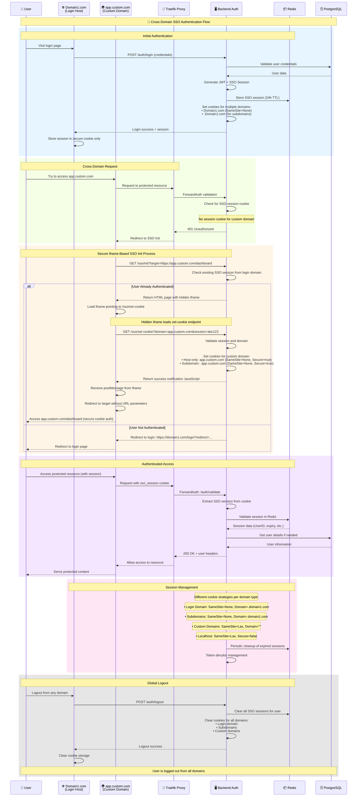

# Cross-Domain SSO Authentication

## Cross-Domain Flow Sequence

```mermaid
sequenceDiagram
    participant U as 👤 User
    participant D1 as 🌐 Domain1.com<br/>(Login Host)
    participant D2 as 🌍 app.custom.com<br/>(Custom Domain)
    participant T as 🔄 Traefik Proxy
    participant BE as 🖥️ Backend Auth
    participant R as 📦 Redis
    participant DB as 🗄️ PostgreSQL

    Note over U,DB: 🔄 Cross-Domain SSO Authentication Flow

    %% Initial Login on Main Domain
    rect rgb(230, 245, 255)
        Note over U,R: Initial Authentication
        U->>D1: Visit login page
        D1->>BE: POST /auth/login (credentials)
        BE->>DB: Validate user credentials
        DB-->>BE: User data
        BE->>BE: Generate JWT + SSO Session
        BE->>R: Store SSO session (24h TTL)
        BE->>BE: Set cookies for multiple domains:<br/>• Domain1.com (SameSite=None)<br/>• .Domain1.com (for subdomains)
        BE-->>D1: Login success + session
        D1->>D1: Store session in secure cookie only
    end

    %% Cross-Domain Access Attempt
    rect rgb(245, 255, 230)
        Note over U,T: Cross-Domain Request
        U->>D2: Try to access app.custom.com
        D2->>T: Request to protected resource
        T->>BE: ForwardAuth validation
        BE->>BE: Check for SSO session cookie
        Note over BE: No session cookie for custom domain
        BE-->>T: 401 Unauthorized
        T-->>D2: Redirect to SSO Init
    end

    %% SSO Initialization Flow (Iframe-Based Cookie Setting)
    rect rgb(255, 245, 230)
        Note over U,BE: Secure Iframe-Based SSO Init Process
        D2->>BE: GET /sso/init?target=https://app.custom.com/dashboard
        BE->>BE: Check existing SSO session from login domain
        alt User Already Authenticated
            BE-->>D2: Return HTML page with hidden iframe
            D2->>D2: Load iframe pointing to /sso/set-cookie
            Note over D2,BE: Hidden iframe loads set-cookie endpoint
            D2->>BE: GET /sso/set-cookie?domain=app.custom.com&session=abc123
            BE->>BE: Validate session and domain
            BE->>BE: Set cookies for custom domain:<br/>• Host-only: app.custom.com (SameSite=None, Secure=true)<br/>• Subdomain: .app.custom.com (SameSite=None, Secure=true)
            BE-->>D2: Return success notification JavaScript
            D2->>D2: Receive postMessage from iframe
            D2->>D2: Redirect to target without URL parameters
            D2-->>U: Access app.custom.com/dashboard (secure cookie auth)
        else User Not Authenticated
            BE-->>D2: Redirect to login: https://domain1.com/login?redirect=...
            D2-->>U: Redirect to login page
        end
    end

    %% Subsequent Requests with Session
    rect rgb(245, 230, 255)
        Note over U,R: Authenticated Access
        U->>D2: Access protected resource (with session)
        D2->>T: Request with sso_session cookie
        T->>BE: ForwardAuth: /auth/validate
        BE->>BE: Extract SSO session from cookie
        BE->>R: Validate session in Redis
        R-->>BE: Session data (UserID, expiry, etc.)
        BE->>DB: Get user details if needed
        DB-->>BE: User information
        BE-->>T: 200 OK + user headers
        T-->>D2: Allow access to resource
        D2-->>U: Serve protected content
    end

    %% Session Synchronization
    rect rgb(255, 230, 245)
        Note over D1,R: Session Management
        Note over BE: Different cookie strategies per domain type:
        Note over BE: • Login Domain: SameSite=None, Domain=.domain1.com
        Note over BE: • Subdomains: SameSite=None, Domain=.domain1.com  
        Note over BE: • Custom Domains: SameSite=Lax, Domain=""
        Note over BE: • Localhost: SameSite=Lax, Secure=false
        
        BE->>R: Periodic cleanup of expired sessions
        BE->>BE: Token denylist management
    end

    %% Cross-Domain Logout
    rect rgb(230, 230, 230)
        Note over U,R: Global Logout
        U->>D1: Logout from any domain
        D1->>BE: POST /auth/logout
        BE->>R: Clear all SSO sessions for user
        BE->>BE: Clear cookies for all domains:<br/>• Login domain<br/>• Subdomains<br/>• Custom domains
        BE-->>D1: Logout success
        D1->>D1: Clear cookie storage
        Note over U,DB: User is logged out from all domains
    end
```

## Description
Cross-domain SSO flow showing how users authenticate once on the main domain and seamlessly access other domains. 