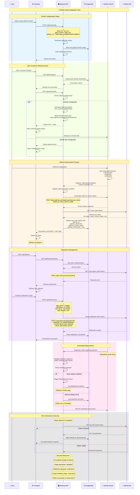

# GitHub OAuth Integration

## OAuth Flow Sequence

```mermaid
sequenceDiagram
    participant U as 👤 User
    participant FE as 🌐 Frontend
    participant BE as 🖥️ Backend API
    participant DB as 🗄️ PostgreSQL
    participant GH as 🔗 GitHub OAuth
    participant GHApi as 📡 GitHub API

    Note over U,GHApi: 🔗 GitHub OAuth Integration Flow

    %% Initial Setup (Admin)
    rect rgb(230, 245, 255)
        Note over U,DB: OAuth Configuration Setup
        U->>FE: Admin setup GitHub OAuth
        FE->>BE: POST /github/config
        Note over BE: {<br/>  client_id: "Iv1.xxx",<br/>  client_secret: "ghp_xxx",<br/>  redirect_uri: "https://api.com/github/auth/callback"<br/>}
        BE->>BE: Generate webhook secret
        BE->>DB: Store encrypted OAuth config
        BE->>BE: Load config into memory
        BE-->>FE: Setup successful
    end

    %% User GitHub Connection
    rect rgb(245, 255, 230)
        Note over U,BE: User Connects GitHub Account  
        U->>FE: Click "Connect GitHub"
        FE->>BE: GET /github/status
        BE->>DB: Check user GitHub connection
        DB-->>BE: Connection status
        BE-->>FE: GitHub not connected
        
        FE->>BE: GET /github/auth/init
        BE->>BE: Check OAuth configuration
        alt OAuth Configured
            BE->>BE: Generate state parameter<br/>user_{userId}_{timestamp}
            BE->>BE: Build GitHub OAuth URL:<br/>https://github.com/login/oauth/authorize
            BE-->>FE: OAuth URL + state
            FE->>FE: Open GitHub OAuth popup
            FE->>GH: Redirect to OAuth URL
        else OAuth Not Configured
            BE-->>FE: Setup required error
            FE->>FE: Show configuration modal
        end
    end

    %% OAuth Authorization Flow
    rect rgb(255, 245, 230)
        Note over U,GHApi: GitHub Authorization Process
        U->>GH: Authorize application
        GH->>GH: User grants permissions:<br/>• repo access<br/>• read:user<br/>• user:email
        GH-->>BE: Callback: /github/auth/callback<br/>?code=xxx&state=xxx
        
        BE->>BE: Validate state parameter (CSRF)
        BE->>GH: Exchange code for access token
        Note over BE: POST https://github.com/login/oauth/access_token<br/>{client_id, client_secret, code}
        GH-->>BE: Access token response
        
        BE->>GHApi: GET /user (with token)
        GHApi-->>BE: GitHub user data:<br/>{id, login, name, email, avatar_url}
        
        BE->>DB: Update user with GitHub info:<br/>• github_id<br/>• github_username<br/>• github_access_token<br/>• github_connected = true
        
        BE-->>FE: Connection successful + user data
        FE->>FE: Update UI state
        Note over FE: GitHub connected ✓
    end

    %% Repository Operations
    rect rgb(245, 230, 255)
        Note over U,GHApi: Repository Management
        U->>FE: View repositories
        FE->>BE: GET /github/repositories
        BE->>DB: Get user's GitHub token
        DB-->>BE: Access token
        BE->>GHApi: GET /user/repos (with token)
        Note over BE: Fetch repos with push permissions
        GHApi-->>BE: Repository list
        BE-->>FE: Filtered repositories
        FE->>FE: Display repo selector
        
        U->>FE: Connect repository to app
        FE->>BE: POST /github/connect
        Note over BE: {<br/>  app_name: "myapp",<br/>  repository_id: 12345,<br/>  full_name: "user/repo",<br/>  auto_deploy: true<br/>}
        
        BE->>GHApi: Create webhook (with token)
        Note over BE: POST /repos/{owner}/{repo}/hooks<br/>• webhook_url: /github/webhook<br/>• events: [push, pull_request]<br/>• secret: generated_secret
        GHApi-->>BE: Webhook created
        
        BE->>DB: Store repository connection
        BE-->>FE: Connection successful
    end

    %% Webhook Processing
    rect rgb(255, 230, 245)
        Note over GH,BE: Automated Deployments
        GH->>BE: Webhook: POST /github/webhook
        Note over GH: Repository push event
        BE->>BE: Validate webhook signature<br/>HMAC-SHA256 with secret
        BE->>BE: Parse webhook payload
        alt Auto-deploy enabled
            BE->>BE: Trigger deployment process
            BE->>DB: Log deployment activity
            Note over BE: Deploy to Dokku app
        else Manual deployment
            BE->>DB: Log webhook received
            Note over BE: Notify user of changes
        end
        BE-->>GH: 200 OK (webhook processed)
    end

    %% Error Handling & Security
    rect rgb(230, 230, 230)
        Note over U,DB: Error Scenarios & Security
        Note over BE: Token Refresh (if needed):
        BE->>GHApi: API call with stored token
        alt Token Expired
            GHApi-->>BE: 401 Unauthorized
            BE->>DB: Mark GitHub as disconnected
            BE-->>FE: Re-authentication required
        else Token Valid
            GHApi-->>BE: Successful response
        end
        
        Note over BE: Security Measures:
        Note over BE: • Encrypted storage of tokens
        Note over BE: • State parameter validation
        Note over BE: • Webhook signature verification
        Note over BE: • Scope limitation (repo, read:user)
        Note over BE: • Token revocation on disconnect
    end
```

## Description
Complete GitHub OAuth integration flow including setup, authentication, repository management, and webhook processing. 