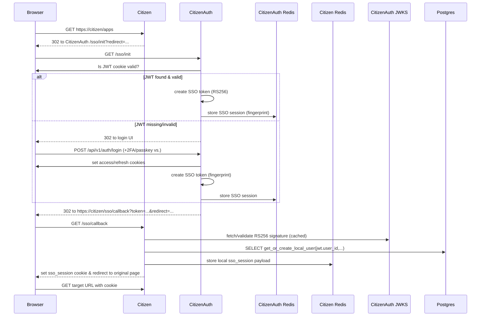
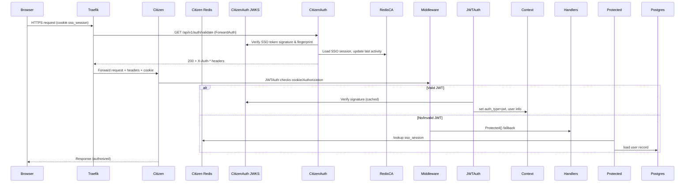
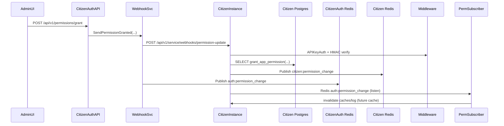
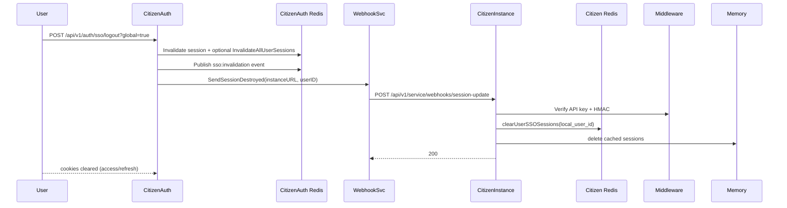

# Citizen ↔ CitizenAuth Authentication Flows

## End-user SSO Login

```mermaid
sequenceDiagram
    participant Browser
    participant Citizen
    participant CitizenAuth
    participant RedisCA as CitizenAuth Redis
    participant RedisC as Citizen Redis

    Browser->>Citizen: GET https://citizen/apps
    Citizen-->>Browser: 302 to CitizenAuth /sso/init?redirect=...
    Browser->>CitizenAuth: GET /sso/init
    CitizenAuth->>Browser: Is JWT cookie valid?
    alt JWT found & valid
        CitizenAuth->>CitizenAuth: create SSO token (RS256)
        CitizenAuth->>RedisCA: store SSO session (fingerprint)
    else JWT missing/invalid
        CitizenAuth-->>Browser: 302 to login UI
        Browser->>CitizenAuth: POST /api/v1/auth/login (+2FA/passkey vs.)
        CitizenAuth->>Browser: set access/refresh cookies
        CitizenAuth->>CitizenAuth: create SSO token (fingerprint)
        CitizenAuth->>RedisCA: store SSO session
    end
    CitizenAuth-->>Browser: 302 to https://citizen/sso/callback?token=...&redirect=...
    Browser->>Citizen: GET /sso/callback
    Citizen->>CitizenAuth JWKS: fetch/validate RS256 signature (cached)
    Citizen->>Postgres: SELECT get_or_create_local_user(jwt.user_id,...)
    Citizen->>RedisC: store local sso_session payload
    Citizen-->>Browser: set sso_session cookie & redirect to original page
    Browser->>Citizen: GET target URL with cookie
```

## Citizen Backend API Request Validation

```mermaid
sequenceDiagram
    participant Browser
    participant Traefik
    participant Citizen
    participant RedisC as Citizen Redis
    participant JWKS as CitizenAuth JWKS

    Browser->>Traefik: HTTPS request (cookie sso_session)
    Traefik->>CitizenAuth: GET /api/v1/auth/validate (ForwardAuth)
    CitizenAuth->>JWKS: Verify SSO token signature & fingerprint
    CitizenAuth->>RedisCA: Load SSO session, update last activity
    CitizenAuth-->>Traefik: 200 + X-Auth-* headers
    Traefik->>Citizen: Forward request + headers + cookie
    Citizen->>Middleware: JWTAuth checks cookie/Authorization
    alt Valid JWT
        JWTAuth->>JWKS: Verify signature (cached)
        JWTAuth->>Context: set auth_type=jwt, user info
    else No/invalid JWT
        Middleware->>Handlers: Protected() fallback
        Protected->>RedisC: lookup sso_session
        Protected->>Postgres: load user record
    end
    Citizen-->>Browser: Response (authorized)
```

## Permission Synchronization

```mermaid
sequenceDiagram
    participant AdminUI
    participant CitizenAuthAPI
    participant WebhookSvc
    participant CitizenInstance
    participant CitizenDB as Citizen Postgres
    participant RedisCA as CitizenAuth Redis
    participant RedisC as Citizen Redis

    AdminUI->>CitizenAuthAPI: POST /api/v1/permissions/grant
    CitizenAuthAPI->>WebhookSvc: SendPermissionGranted(...)
    WebhookSvc->>CitizenInstance: POST /api/v1/service/webhooks/permission-update
    CitizenInstance->>Middleware: APIKeyAuth + HMAC verify
    CitizenInstance->>CitizenDB: SELECT grant_app_permission(...)
    CitizenInstance->>RedisC: Publish citizen:permission_change
    WebhookSvc->>RedisCA: Publish auth:permission_change
    CitizenInstance->>PermSubscriber: Redis auth:permission_change (listen)
    PermSubscriber->>CitizenInstance: invalidate caches/log (future cache)
```

## Session Invalidation / Logout

```mermaid
sequenceDiagram
    participant User
    participant CitizenAuth
    participant RedisCA as CitizenAuth Redis
    participant WebhookSvc
    participant CitizenInstance
    participant RedisC as Citizen Redis

    User->>CitizenAuth: POST /api/v1/auth/sso/logout?global=true
    CitizenAuth->>RedisCA: Invalidate session + optional InvalidateAllUserSessions
    CitizenAuth->>RedisCA: Publish sso:invalidation event
    CitizenAuth->>WebhookSvc: SendSessionDestroyed(instanceURL, userID)
    WebhookSvc->>CitizenInstance: POST /api/v1/service/webhooks/session-update
    CitizenInstance->>Middleware: Verify API key + HMAC
    CitizenInstance->>RedisC: clearUserSSOSessions(local_user_id)
    CitizenInstance->>Memory: delete cached sessions
    CitizenInstance-->>WebhookSvc: 200
    User-->>CitizenAuth: cookies cleared (access/refresh)
```

